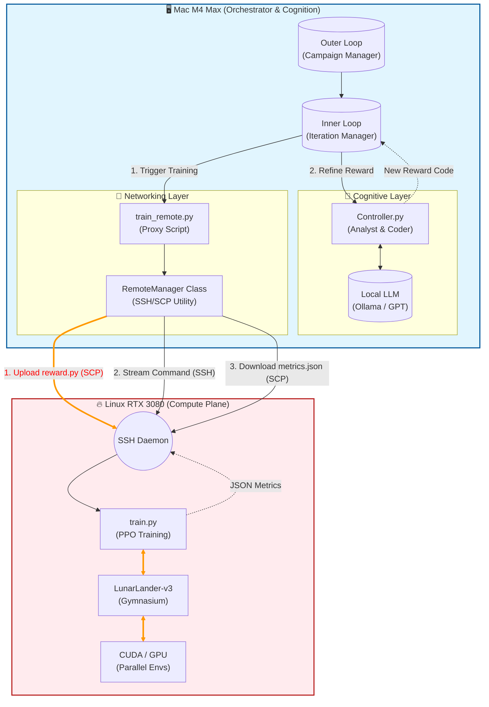

```mermaid
graph TD
    %% SUBGRAPH: MAC (CONTROL PLANE)
    subgraph MAC ["🖥️ Mac M4 Max (Orchestrator & Cognition)"]
        style MAC fill:#e1f5fe,stroke:#01579b,stroke-width:2px
        
        OL[("Outer Loop<br>(Campaign Manager)")] --> IL[("Inner Loop<br>(Iteration Manager)")]
        
        subgraph COG ["🧠 Cognitive Layer"]
            LLM[("Local LLM<br>(Ollama / GPT)")]
            CONTROLLER["Controller.py<br>(Analyst & Coder)"]
            CONTROLLER <--> LLM
        end
        
        subgraph NET ["📡 Networking Layer"]
            PROXY["train_remote.py<br>(Proxy Script)"]
            RM["RemoteManager Class<br>(SSH/SCP Utility)"]
            PROXY --> RM
        end
        
        IL -- "1. Trigger Training" --> PROXY
        IL -- "2. Refine Reward" --> CONTROLLER
    end

    %% SUBGRAPH: LINUX (COMPUTE PLANE)
    subgraph LINUX ["🔥 Linux RTX 3080 (Compute Plane)"]
        style LINUX fill:#ffebee,stroke:#b71c1c,stroke-width:2px
        
        SSHD(("SSH Daemon"))
        TRAINER["train.py<br>(PPO Training)"]
        ENV["LunarLander-v3<br>(Gymnasium)"]
        GPU["CUDA / GPU<br>(Parallel Envs)"]
        
        SSHD --> TRAINER
        TRAINER <--> ENV
        ENV <--> GPU
    end

    %% DATA FLOWS ACROSS THE NETWORK
    RM -- "1. Upload reward.py (SCP)" --> SSHD
    RM -- "2. Stream Command (SSH)" --> SSHD
    RM -- "3. Download metrics.json (SCP)" --> SSHD
    
    %% FEEDBACK LOOP
    TRAINER -.->|"JSON Metrics"| SSHD
    CONTROLLER -.->|"New Reward Code"| IL
    
    %% STYLING
    linkStyle 6,7,8 stroke:#ff9800,stroke-width:3px,color:red;
```