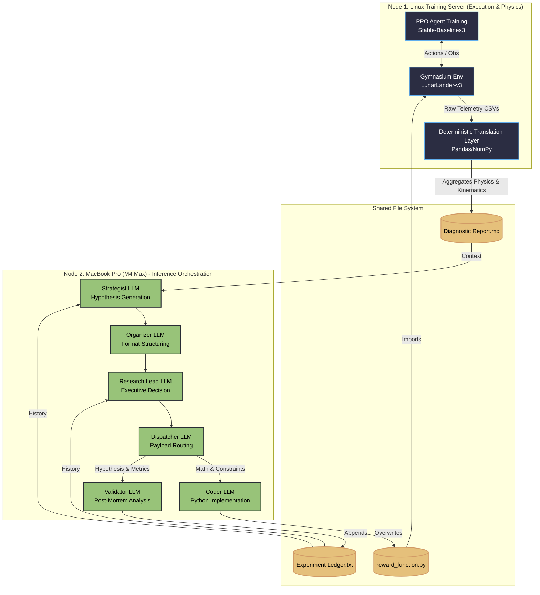

# Autonomous Algorithmic Reward Design (ARD) via Multi-Agent Orchestration

**A locally-hosted, closed-loop pipeline that translates continuous-control physics into deterministic statistics to autonomously write, train, and debug Reinforcement Learning reward functions.**

## Executive Summary

Reinforcement Learning (RL) is notorious for its brittleness. Reward shaping is traditionally a manual "dark art" where a slight miscalculation in a penalty coefficient causes an agent to exploit the environment—like hovering indefinitely to farm survival points instead of landing.

This project completely automates the Algorithmic Reward Design (ARD) cycle. It replaces human intuition with a 6-stage Multi-Agent LLM architecture that evaluates physical telemetry, generates novel mathematical reward functions, writes the Python code, trains a PPO agent, and scientifically validates the outcome.

**Key Innovations:**

* **The Deterministic Translation Layer:** Instead of feeding raw neural network weights, this pipeline translates PPO rollout telemetry into **objective statistics** (e.g., Critic Saturation Index). It converts an RL black-box into an interpretable tabular problem.

* **Isolated "Chain-of-Agents" Architecture:** Reasoning is strictly decoupled from execution to prevent hallucination. A **Strategist** generates hypotheses, while a **Coder** injects logic directly into the Gymnasium environment wrapper.

* **Algorithmic Credit Assignment:** The system computes **Pearson correlations** between reward components and task success. A Validator agent identifies "Traitor Components" to prevent cyclic reward hacking.

* **High-Efficiency Local Execution:** Designed to run unsupervised on local hardware. A single 8B-parameter model rewrites physics and trains the agent in **under 8 minutes per iteration**.

## System Architecture: The Decoupled Loop

The pipeline is strictly divided into two domains: **Execution & Translation** (Linux Compute Node) and **Meta-Reasoning & Orchestration** (MacBook Pro + Local LLMs). By heavily decoupling these processes, the system prevents common LLM failure modes like syntax hallucination and context-window saturation.

### Phase 1: Deterministic Translation (The Physics Engine)

Raw Reinforcement Learning telemetry is practically unreadable for an LLM. Before the AI sees anything, a deterministic Python layer intercepts the PPO training logs (via Stable-Baselines3) and translates raw float values into scientifically grounded metrics:

* **Critic Saturation Index (CSI):** Measures Value network divergence to detect noisy reward gradients.
* **Trajectory Isomorphism:** Calculates cross-seed pairwise correlations to measure optimization landscape stability.
* **Algorithmic Credit Assignment:** Uses dynamic proxy metrics (e.g., Euclidean Kinematic Stability vs. Spatial Proximity) to compute the Pearson correlation between individual mathematical reward terms and actual task success.

### Phase 2: Multi-Agent Meta-Reasoning (The Brain)

Instead of relying on a single prompt to design and code the reward, the pipeline uses a "Chain-of-Agents" routing protocol. Each agent has a single, highly restricted objective:

1. **The Strategist:** Reads the translated physics report and generates 3 distinct, novel mathematical hypotheses to fix the reward topology.
2. **The Organizer:** A strict syntax parser that sanitizes the Strategist's chaotic output into a pristine "Mathematical Contract" markdown schema.
3. **The Research Lead:** The executive filter. It cross-references the proposals against historical failures, applies Occam's Razor, and selects the single most viable equation.
4. **The Dispatcher:** Routes the Research Lead's decision, extracting the raw math into an XML `<CODER_PAYLOAD>` and the scientific hypotheses into an XML `<VALIDATOR_PAYLOAD>`.
5. **The Coder:** Operates in a strict syntax-only sandbox. It translates the mathematical payload into production-ready Python for the Gymnasium environment wrapper without altering the logic.
6. **The Validator (Post-Mortem):** Evaluates the *next* iteration's diagnostic report against the original hypothesis. It specifically hunts for **Goodhart's Law** exploits (e.g., an agent hovering to farm survival points instead of landing) and compresses the failure into an immutable lesson.

### Phase 3: Evolutionary Memory

The Validator's output is permanently written to the **Experiment Ledger**. In subsequent iterations, the Strategist and Research Lead must read this ledger, ensuring the system never repeats a failed hypothesis and learns continuously from its physical environment.

