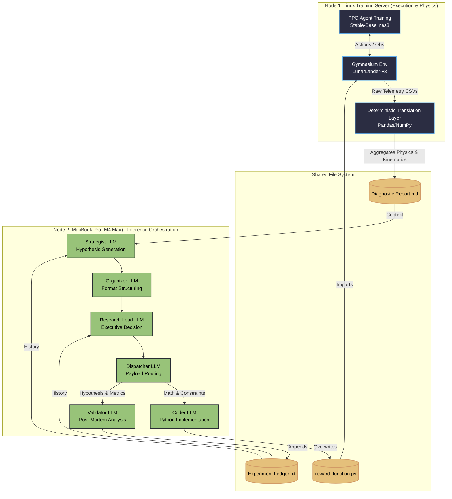

```mermaid
graph TD
    %% Define Styles
    classDef linux fill:#2b2d42,stroke:#61afef,stroke-width:2px,color:#fff
    classDef mac fill:#fdf6e3,stroke:#e06c75,stroke-width:2px,color:#333
    classDef llm fill:#98c379,stroke:#282c34,stroke-width:2px,color:#000
    classDef file fill:#e5c07b,stroke:#d19a66,stroke-width:2px,color:#000

    %% Subgraphs for Hardware Separation
    subgraph "Node 1: Linux Training Server (Execution & Physics)"
        A[PPO Agent Training<br/>Stable-Baselines3]:::linux
        B[Gymnasium Env<br/>LunarLander-v3]:::linux
        C[Deterministic Translation Layer<br/>Pandas/NumPy]:::linux
        
        A <-->|Actions / Obs| B
        B -->|Raw Telemetry CSVs| C
    end

    subgraph "Shared File System"
        D[(Diagnostic Report.md)]:::file
        E[(Experiment Ledger.txt)]:::file
        F[(reward_function.py)]:::file
    end

    subgraph "Node 2: MacBook Pro (M4 Max) - Inference Orchestration"
        G[Strategist LLM<br/>Hypothesis Generation]:::llm
        H[Organizer LLM<br/>Format Structuring]:::llm
        I[Research Lead LLM<br/>Executive Decision]:::llm
        J[Dispatcher LLM<br/>Payload Routing]:::llm
        K[Coder LLM<br/>Python Implementation]:::llm
        L[Validator LLM<br/>Post-Mortem Analysis]:::llm
        
        G --> H
        H --> I
        I --> J
        J -->|Math & Constraints| K
        J -->|Hypothesis & Metrics| L
    end

    %% Cross-Node Connections
    C -->|Aggregates Physics & Kinematics| D
    D -->|Context| G
    E -->|History| G
    E -->|History| I
    K -->|Overwrites| F
    F -->|Imports| B
    L -->|Appends| E
```
